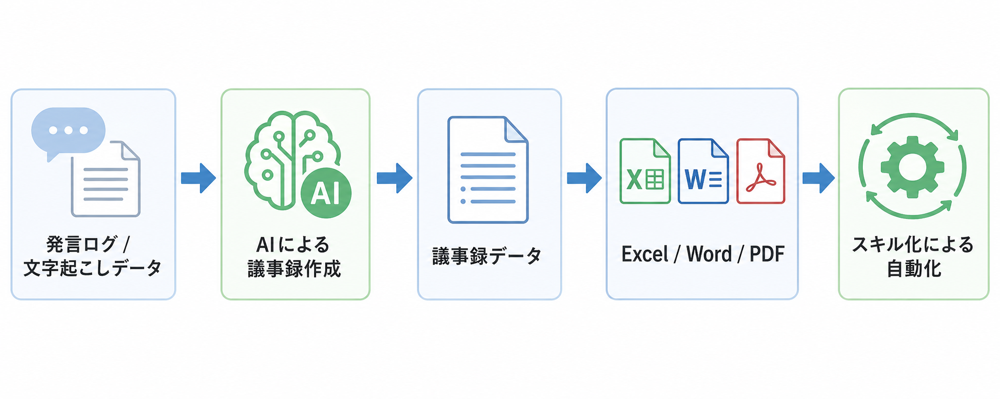
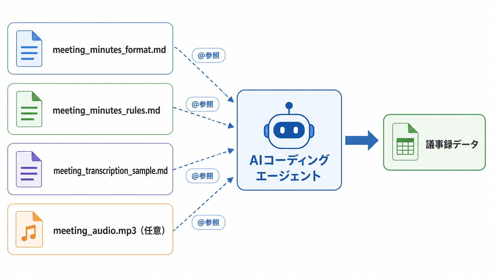
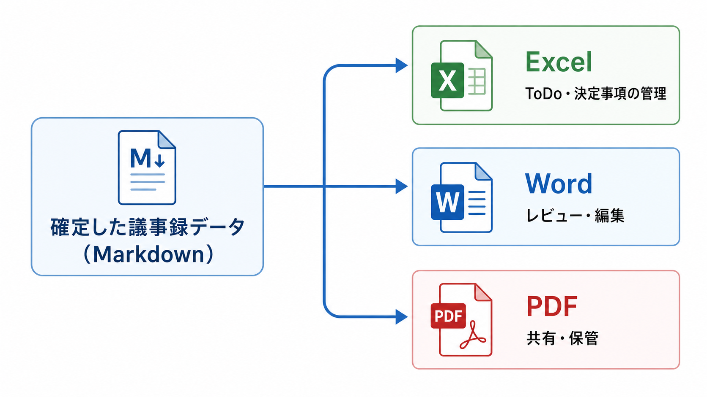
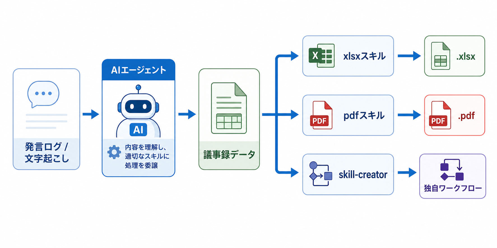
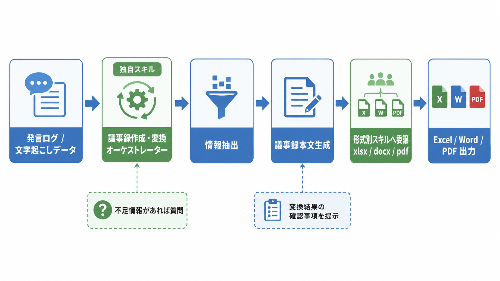

# 発言ログをもとに議事録を作成する

会議中の発言ログから、議論の内容、決定事項、対応すべきタスクなどを整理し、実用的な議事録を効率よく作成する。

## AIを活用した議事録作成の考え方

AIを活用すれば、会議の録音データ、会話ログ、文字起こしデータなどから議事録の原案を効率的に生成できる。
一方で、発言ログには、結論に直接関係する発言だけでなく、確認のためのやり取り、言い直し、補足説明、雑談、曖昧な表現なども多く含まれる。そのため、AIに単に「議事録を作成して」と指示しただけでは、何を重要情報として採用し、どこまで要約し、どのような構成で整理するべきかの判断が一定せず、出力内容がぶれやすい。

そのため、業務でそのまま利用できる品質の議事録を作成するには、AIに対してあらかじめ**何を記載対象とし、どのような構成で、どの程度詳しく整理するのかを具体的に指定する**ことで、AIは発言ログの中から必要な情報を選別しやすくなり、実務でそのまま共有しやすい、統一感のある議事録を出力しやすくなる。



**出力フォーマット例**
```markdown
## 1. 基本情報

| 項目 | 内容 |
|---|---|
| 会議名 |  |
| 開催日時 |  |
| 開催場所 / 形式 | 例：会議室A / Zoom / Teams |
| 主催者 |  |
| 議事録作成者 |  |
| 参加者 |  |
| 欠席者 |  |
| 配布資料 |  |
| 関連リンク |  |

---

## 2. 会議の目的

<!-- この会議で何を確認・議論・決定するために開催されたのかを簡潔に記載 -->

-

---

## 3. アジェンダ

| No. | 議題 | 担当者 | 予定時間 |
|---:|---|---|---:|
| 1 |  |  |  |
| 2 |  |  |  |
| 3 |  |  |  |

---

## 4. 要約

<!-- 発言ログ全体から、会議の結論・主要論点・重要な合意事項を短く要約 -->

-
-
-

---

## 5. 決定事項

| No. | 決定事項 | 背景 / 理由 | 関係者 | 決定日時 |
|---:|---|---|---|---|
| 1 |  |  |  |  |
| 2 |  |  |  |  |

---

## 6. 議論内容

### 議題1：〇〇

#### 論点

-
-

#### 主な発言・意見

| 発言者 | 内容 | 補足 |
|---|---|---|
|  |  |  |
|  |  |  |

#### 議論の整理

- 賛成意見：
  -
- 懸念・反対意見：
  -
- 未解決の論点：
  -

#### 結論

-

---

### 議題2：〇〇

#### 論点

-
-

#### 主な発言・意見

| 発言者 | 内容 | 補足 |
|---|---|---|
|  |  |  |
|  |  |  |

#### 議論の整理

- 賛成意見：
  -
- 懸念・反対意見：
  -
- 未解決の論点：
  -

#### 結論

-

---

## 7. ToDo / アクションアイテム

| No. | タスク | 担当者 | 期限 | 優先度 | ステータス | 備考 |
|---:|---|---|---|---|---|---|
| 1 |  |  |  | 高 / 中 / 低 | 未着手 / 進行中 / 完了 |  |
| 2 |  |  |  | 高 / 中 / 低 | 未着手 / 進行中 / 完了 |  |

---

## 8. 保留事項・未決事項

| No. | 内容 | 保留理由 | 次回確認者 | 確認予定日 |
|---:|---|---|---|---|
| 1 |  |  |  |  |
| 2 |  |  |  |  |

---

## 9. リスク・懸念事項

| No. | リスク / 懸念 | 影響 | 対応方針 | 担当者 |
|---:|---|---|---|---|
| 1 |  | 高 / 中 / 低 |  |  |
| 2 |  | 高 / 中 / 低 |  |  |

---

## 10. 次回会議

| 項目 | 内容 |
|---|---|
| 次回開催日時 |  |
| 開催場所 / 形式 |  |
| 主な議題 |  |
| 事前準備事項 |  |
| 参加予定者 |  |

---

## 11. 補足・備考

<!-- 発言ログ上は重要だが、決定事項やToDoには該当しない情報を記載 -->

-
-

---

## 12. 発言ログからの抽出メモ

<!-- 議事録作成時の根拠として、必要に応じて元発言を簡潔に残す -->

| 時刻 | 発言者 | 発言要旨 | 関連議題 |
|---|---|---|---|
|  |  |  |  |
|  |  |  |  |
```

[会議中の発言ログ](https://github.com/Gifted-People-Support-Association/Generative_AI_Intermediate_Seminar/blob/main/datasets/text/meeting_transcription_sample.md)から上記のようなフォーマットに従った議事録データを作成するには？

### 1.Gemini、ChatGPT（チャット型AI）を使用する場合
GeminiやChatGPTなどのチャット型AIを活用して、指定フォーマットに沿った議事録を作成する場合は、チャット欄に必要な条件や出力形式をプロンプトとして具体的かつ明確に入力することが重要である。
指示内容が明瞭であるほど、実務でそのまま利用しやすい、整理された形式の議事録を出力しやすくなる。


**プロンプト例：**
```markdown
# 指示内容
以下は会議の文字起こしデータです。内容を分析し

## 文字起こしデータ
【入力データ（会議の文字起こしデータを張り付け）】

## 出力形式
【AIにどのような出力を返して欲しいか（上記のフォーマット例を張り付け）】
```

また、ChatGPTのプロジェクト機能やGeminiのGemsに設定可能な事前指示プロンプトに上記のプロンプトを設定しておくことで毎回プロンプトを入力する手間を減らせる。

### 2. Claude Code や Antigravity などの AIコーディングエージェントを使用する場合

Claude Code や Antigravity などのAIコーディングエージェントを使用する場合は、議事録の出力フォーマットを記載したファイルと、実際の音声データや発言ログのファイルを、対象プロジェクト配下にあらかじめ配置しておく方法が有効である。

この方法を用いると、プロンプト内に長いフォーマット定義や発言ログを直接貼り付けなくても、`@` 指定などによって必要なファイルを参照させることができる。
そのため、毎回同じ説明やフォーマットをプロンプトへ手入力する手間を減らしながら、一定の条件に従った議事録を作成しやすくなる。



たとえば、以下のようなファイルを用意しておくと整理しやすい。

- 議事録フォーマットを記載したファイル
  例：`meeting_minutes_format.md`

- 記載ルールや厳守事項をまとめたファイル
  例：`meeting_minutes_rules.md`

- 会議ごとの発言ログや文字起こしデータ
  例：`meeting_transcription_sample.md`

- 必要に応じて音声ファイル
  例：`meeting_audio.mp3`

この構成にしておけば、たとえば「`@meeting_minutes_format.md` と `@meeting_transcription_sample.md` を参照して議事録を作成してください」といった形で指示できる。


## 議事録データを別形式のファイルに変換する

AIを活用して作成した議事録データは、必要に応じて Excel 形式（.xlsx）や Word 形式（.docx）、PDF形式などのファイルに変換することで、共有、編集、保管をしやすい形に整えられる。

特に、関係者への配布、内容の修正、社内文書としての保存を行う場面では、用途に応じて適切なファイル形式へ変換することが重要である。
たとえば、文章中心で閲覧・レビューしやすい形にしたい場合は Word 形式が適しており、ToDo や決定事項を表形式で管理・更新したい場合は Excel 形式が適している。

この作業を効率よく進めるには、まず議事録データの内容を確定したうえで、変換に使用するツールを選定し、変換後にレイアウトや記載内容に問題がないかを確認してから出力する、という手順で進めるのが望ましい。



## 【チャット型AI、AIコーディングエージェント共通】AIが出力した内容をコピーし、指定のファイルに直接貼り付けたうえで、必要に応じて手動で加工する方法の手順

この方法では、AIに議事録の内容を出力させた後、その結果を利用者が手動で所定のファイルへ反映する。
特別な自動変換機能やエージェントスキルを利用しなくても実施できるため、最も取り組みやすい方法である。
一方で、最終的な体裁調整や記載内容の確認は手作業で行う必要があるため、ファイル形式によっては手間がかかり、PDFといった一部のファイルでは別途変換処理が必要となる。

### 手順1. AIに議事録データを出力させる

まず、チャット型AIまたはAIコーディングエージェントに対して、会議の発言ログや文字起こしデータを入力し、必要な議事録形式で出力させる。

### 手順2. 出力内容を指定のファイルにコピー＆ペーストする

内容を確認したら、AIが出力した議事録データをコピーし、指定されたファイル（.xlsx、.dotx、スプレッドシート、Googleドキュメント等）に貼り付ける。

## AIエージェントとエージェントスキルを活用して、指定されたファイル形式に変換
Claude（Web、Desktop、Cowork、ClaudeCode）、Antigravityとエージェントスキルを組み合わせて、議事録を指定のファイル形式に変換する。

この方法では、AIに対して議事録の内容整理だけでなく、Word 形式（.docx）や Excel 形式（.xlsx）など、目的に応じたファイルの生成まで一連で実行させることが可能である。
そのため、手動でコピー＆ペーストして整形する方法に比べて、変換作業や体裁調整の手間を減らしやすい。

特に、あらかじめ議事録の出力フォーマット、記載ルール、変換先のファイル形式を明確に定義しておけば、毎回同じ手順で一貫した形式のファイルを生成しやすくなる。
一方で、利用するAIエージェントやスキルによって対応可能なファイル形式や操作方法が異なるため、事前に利用環境と変換手順を確認しておく必要がある。



本ゼミではAnthropicの公式エージェントスキル（[xlsx](https://github.com/anthropics/skills/blob/main/skills/xlsx/SKILL.md)、[pdf](https://github.com/anthropics/skills/blob/main/skills/pdf/SKILL.md)、[skill-creator](https://github.com/anthropics/skills/blob/main/skills/skill-creator/SKILL.md)）を使って自動処理を行っていきます。

### Excel形式への変換までを自動化するケースの手順

Anthropic の公式エージェントスキルである xlsx スキルを利用することで、AIが生成した議事録データをもとに Excel ファイル（.xlsx）を直接作成させたり、既存の Excel ファイルに必要な内容を追記・更新させたりできる。

この方法では、議事録の内容整理から Excel 形式への反映までを一連の処理として実行できるため、手動でコピー＆ペーストを行いながら表を整形する場合に比べて、作業負荷を軽減しやすい。
特に、決定事項、ToDo、保留事項、リスク一覧などをあらかじめ定めたシート構成や表形式で管理したい場合に有効である。

実施にあたっては、まず議事録として整理すべき項目、Excel ファイル内のシート構成、列名、記載ルールなどを明確に定義する。
そのうえで、AIに対して、議事録データを指定の構造に従って Excel ファイルへ出力するよう指示する。既存のテンプレートファイルがある場合は、そのファイルを参照させたうえで、所定のセル範囲や表構造に合わせて内容を反映させる運用も可能である。

このように、Excel 形式への変換工程まで自動化することで、毎回同じ形式の議事録ファイルを安定して生成しやすくなり、記載ゆれや転記漏れの抑制にもつながる。
一方で、期待するレイアウトや記入位置を正確に反映させるためには、テンプレートの構造や出力ルールを事前に十分整理しておくことが重要である。

### 手順1. xlsxスキルを現在開いているディレクトリ配下にインストールする。（ClaudeCode、Antigravity、Cursor、GitHub Copilotのみ）
AIエージェントの各CLIツールやIDEを使用している場合は各ツールごとに応じたインストールを行い、AIエージェントがxlsxスキルが認識できる状態にする必要がある。
Claude、Claude Desktopは既存設定でインストールされている為、追加のインストールは不要

**ClaudeCodeの場合**
Claude Code では、まず Anthropic の skills リポジトリをプラグインマーケットプレイスとして登録し、その後に `document-skills` プラグインをインストールする。公式リポジトリでは、次の手順が案内されている。

```bash
/plugin marketplace add anthropics/skills
```

続いて、Claude Code 上で次の流れでインストールする。

1. `Browse and install plugins` を選択する
2. `anthropic-agent-skills` を選択する
3. `document-skills` を選択する
4. `Install now` を実行する

または、次のコマンドで直接インストールできる。

```bash
/plugin install document-skills@anthropic-agent-skills
```

`xlsx` スキルは `document-skills` に含まれているため、インストール後は Excel ファイルの作成や更新を依頼する文脈で利用できる。

**Antigravity、Cursor、Codexの場合**
Antigravity では `.agents/skills/`、Cursor では `.cursor/skills/` または `.agents/skills/`、Codex では任意の場所にスキルを配置し、必要に応じて設定ファイルから参照できるようにする。利用するツールごとのスキル格納先に xlsx スキルを配置しておくことで、Excel ファイルの生成や更新を伴うタスクで呼び出せるようになる。

Antigravity の例:

```bash
git clone https://github.com/anthropics/skills.git
mkdir -p .agents/skills
cp -r skills/skills/xlsx .agents/skills/
```

Cursor の例:

```bash
git clone https://github.com/anthropics/skills.git
mkdir -p .cursor/skills
cp -r skills/skills/xlsx .cursor/skills/
```

Codex の例:

```bash
git clone https://github.com/anthropics/skills.git
mkdir -p .agents/skills
cp -r skills/skills/xlsx .agents/skills/
```

Codex では、必要に応じて `AGENTS.md` などの設定ファイルでスキルの参照場所を指定する。

**GitHub Copilotの場合**
GitHub Copilot で利用する場合は、`.github/skills/` 配下に xlsx スキルを配置する。Copilot では自動判定だけでなく、チャット画面から対象スキルを明示的に選択して利用する運用を想定すると分かりやすい。配置例は次のとおり。

```bash
git clone https://github.com/anthropics/skills.git
mkdir -p .github/skills
cp -r skills/skills/xlsx .github/skills/
```

配置後は、GitHub Copilot Chat から対象スキルを選択するか、Excel ファイル作成の文脈で利用する。

## 手順2. 各AIエージェントツールの入力欄から **/xlsx**でスキルを呼び出し、次のように実行させたいタスクを要件としてプロンプトに記述する。

**議事録データをもとに、新規の Excel ファイル（.xlsx）を作成する場合**
指示プロンプト例
```markdown
以下の議事録データをもとに、Excel ファイル（.xlsx）を作成してください。

## 出力先
ファイル名：minutes_YYYYMMDD.xlsx
保存先：現在のディレクトリ

## シート構成
- Sheet1「基本情報・要約」：会議名、開催日時、開催場所 / 形式、主催者、議事録作成者、参加者、欠席者、配布資料、関連リンク、会議の目的、要約を記載する
- Sheet2「アジェンダ・議論内容」：アジェンダ一覧、各議題の論点、主な発言・意見、議論の整理、結論を記載する
- Sheet3「決定事項・ToDo」：決定事項一覧と ToDo / アクションアイテム一覧を記載する
- Sheet4「保留事項・リスク・次回会議」：保留事項・未決事項、リスク・懸念事項、次回会議の予定を記載する
- Sheet5「補足・抽出メモ」：補足・備考と、発言ログからの抽出メモを記載する


## 議事録データ
（ここに議事録の内容を貼り付け）

```

**既存の Excel ファイル（.xlsx）を使用して、議事録データをExcelファイルに変換する場合**

指示プロンプト例
```markdown
以下の議事録データをもとに、既存の Excel ファイル（.xlsx）へ内容を反映してください。

## 入力ファイル
- 既存ファイル名：minutes_template.xlsx
- 保存先：現在のディレクトリ

## 出力ファイル
- 出力ファイル名：minutes_filled_YYYYMMDD.xlsx
- 元のテンプレートは上書きせず、別名で保存する

## 反映ルール
- 既存のシート構成、表の位置、見出し、セルの書式はできるだけ維持する
- 既存ファイル内に同名または対応する見出し・表がある場合は、その場所へ内容を反映する
- 決定事項、ToDo、保留事項、リスクなどの一覧は、既存の表の列構成に合わせて追記または更新する
- 発言ログに情報がない項目は空欄のままにするか、「要確認」と記載する
- 入力データと既存テンプレートの項目が一致しない場合は、無理に埋めず、どの項目を反映できなかったか分かるようにする
- 既存テンプレートにない項目は、必要に応じて末尾の空き領域または補足用シートに整理して追記する

## 優先して反映したい項目
- 基本情報
- 会議の目的
- 要約
- アジェンダ
- 決定事項
- ToDo / アクションアイテム
- 保留事項・未決事項
- リスク・懸念事項
- 次回会議
- 補足・抽出メモ

## 議事録データ
（ここに議事録の内容を貼り付け）

## 補足指示
- 反映後に、どのシートまたは表へ何を記入したかを簡潔に示す
- 既存ファイルの構造上、手動確認が必要な箇所があれば最後に列挙する
```

### 演習問題：pdfスキルを活用して議事録データをPDF形式に変換する

ここでは、AIエージェントと Anthropic の公式 pdf スキルを利用して、作成した議事録データを PDF ファイルとして出力する演習を行う。

#### 演習の目的

- 議事録データを PDF 形式へ変換する手順を体験する
- PDF 出力時に必要な指示の粒度を理解する
- 生成された PDF のレイアウトや記載内容を確認し、必要な見直し点を整理できるようにする

#### 課題

作成済みの議事録データをもとに、pdf スキルを使って PDF ファイルを生成してください。
その際、見出し構成、表組み、改ページ、余白、フォントサイズなど、PDF として読みやすい体裁になるように具体的な条件を付けて指示してください。

#### 確認ポイント

- 見出しや表が崩れずに出力されているか
- 決定事項、ToDo、保留事項、リスクなどの重要項目が正しく反映されているか
- 改ページ位置や余白が不自然でないか
- そのまま共有資料として利用できる体裁になっているか

#### 補足

pdf スキルは PDF の読取・編集・結合・分割・フォーム入力に加え、新規 PDF 作成にも対応している。ただし、複雑なレイアウトやテンプレート準拠の文書を安定して出力するには、条件を具体的に指定したうえで、生成結果を十分に確認する必要がある。実務では、内容確定後に編集可能形式から PDF 化する運用の方が適する場合もある。

## Skill-Creatorを使用して独自のワークフローを作成し、議事録作成から指定されたファイル形式に変換までのプロセスを自動化
上記のように、音声データの抽出、指定フォーマットへの整形、特定のファイル形式への変換といった一連のタスクをAIに指示することで自動化が可能だった。
ただし、タスクの種類ごとに毎回プロンプトを入力する必要がある点が課題。
また、同様の一連のタスクを繰り返し実行する場合、ユーザーが入力するプロンプトやAIの出力結果にばらつきが生じ、生成される成果物に一貫性が欠ける。
そこで、これまでの一連の流れをスキルとして定義し、
必要なタイミングで呼び出すことで、毎回プロンプトを入力する手間を省き、
タスクの進行や出力形式に一定の一貫性を持たせることが可能。



### 手順1. skill-creatorを現在開いているディレクトリ配下にインストールする。（ClaudeCode、Antigravity、Cursor、GitHub Copilotのみ）
AIエージェントの各CLIツールやIDEを使用している場合は各ツールごとに応じたインストールを行い、AIエージェントがskill-creatorが認識できる状態にする。
Claude、Claude Desktopは既存設定でインストールされている為、追加のインストールは不要。

IDE、ツールに応じたインストール手順については、xlsxスキルをインストールした時の手順と同様。

### 手順2. skill-creatorスキルを呼び出して、一連の流れを自動化するスキルを作成する。
AIエージェントの入力欄で **/skill-creator** で呼び出し、次のように実行させたいタスクの流れを要件としてプロンプトに記述する。

指示プロンプト
```markdown
会議の発言ログや文字起こしデータを入力として受け取り、指定されたフォーマットで
議事録を作成し、その後に指定されたファイル形式へ変換できる新しいスキルを作成してください。

要件は以下のとおりです。

- スキル名は、会議の議事録作成とファイル変換の用途が分かるものにしてください。
- このスキルは、会議の発言ログ、文字起こしデータ、メモをもとに、重要事項を抽出して議事録を作成できるようにしてください。
- 出力する議事録は、本資料内で示している議事録フォーマットに沿って、見出し、表、ToDo、決定事項、保留事項、リスク、次回会議情報まで整理できるようにしてください。
- 発言ログに含まれていない情報は断定せず、未確認情報として空欄または「要確認」と明示するようにしてください。
- 決定事項、ToDo、保留事項、懸念事項は、発言内容の根拠に基づいて抽出するようにしてください。
- ユーザーが変換先として指定したファイル形式に応じて、Excel 形式、Word 形式、PDF形式などに出力できるワークフローにしてください。
- 既存のテンプレートファイルが指定された場合は、そのファイル構造に合わせて反映できるようにしてください。
- 必要な入力情報が不足している場合は、処理を始める前に確認事項をユーザーへ質問するようにしてください。
- スキルの説明文には、どのような場面で呼び出すべきかが分かるように、議事録作成、会議記録整理、文字起こし要約、Excel出力、Word出力、PDF出力などの文脈を含めてください。
- 出力言語は日本語にしてください。

- このスキルはオーケストレーター（司令塔）として機能させ、変換ステップでは
  以下の既存スキルを明示的に呼び出す構成にしてください：
  - Excel 形式への変換 → xlsx スキルを呼び出す
  - Word 形式への変換  → docx スキルを呼び出す
  - PDF 形式への変換   → pdf スキルを呼び出す
  各スキルへの引き渡し方法（前ステップの出力をどう渡すか）も SKILL.md に明記してください。
- 呼び出し先スキルが未インストールの場合は、その旨をユーザーに通知してください。

スキルの中では、少なくとも以下の流れを扱えるようにしてください。

1. 入力された発言ログまたは文字起こしデータの確認
2. 議事録に必要な情報の抽出
3. 指定フォーマットに沿った議事録本文の生成
4. 指定ファイル形式への変換（ファイル形式に応じた個別スキルへの委譲）
   - Excel の場合：xlsx スキルを呼び出し、議事録データを渡して .xlsx を生成する
   - Word の場合：docx スキルを呼び出し、議事録データを渡して .docx を生成する
   - PDF の場合：pdf スキルを呼び出し、議事録データを渡して .pdf を生成する
5. 変換結果の確認事項の提示

可能であれば、以下も含めてください。

- このスキルを検証するための現実的なテストプロンプトを2〜3件作成する
- スキルの想定入出力と成功条件が分かるようにする
- 利用者が初学者でも使いやすいように、説明を簡潔で明確にする
- テストケースには、各変換スキル（xlsx / docx / pdf）が正しく呼び出されることを
  検証できるケースを少なくとも1件ずつ含めてください
- スキル間の連携部分（前ステップの出力を次スキルへ渡す箇所）が
  SKILL.md から読み取れるように記述してください

最終的に、SKILL.md の草案と、必要であれば評価用のテストケース案も作成してください。

```
